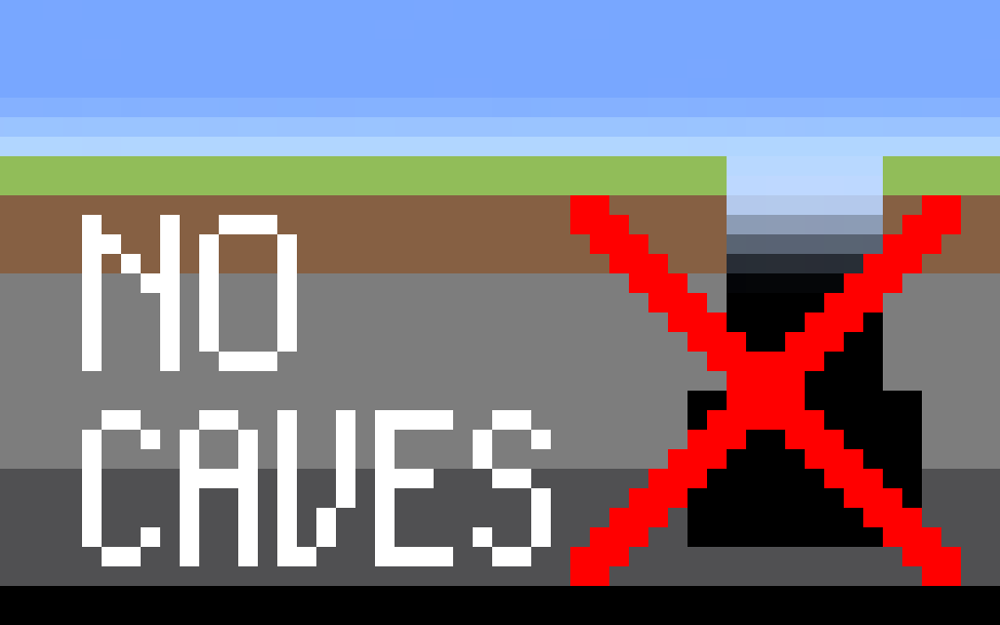

# NoCaves

\
\

Disables Noise Caves, Density Function Caves, Carver Caves, and Carver Canyons based on the configuration, and maintains
compatibility with other terrain modification mods and data packs as much as possible. Affects all biomes and all world
generation presets by default.

根据配置禁用噪声洞穴、密度函数洞穴、雕刻器洞穴和雕刻器峡谷，并尽可能保持与其他地形修改模组和数据包的兼容性。默认影响所有生物群系和所有世界生成预设。

## Configuration 配置

The configuration file is located at `config/no_caves.json`. If the configuration file does not exist or is corrupted, a
new one will be generated. If the configuration file is incomplete, a new one will be generated by merging the existing
values with the default values.\
配置文件位于`config/no_caves.json`。如果配置文件不存在或损坏，会重新生成一份。如果配置文件不完整，会合并已有值和默认值并重新生成一份。

### `enableCarverFilter`

Boolean, default = `true`

Set to `true` to enable the carver filter.\
设置为`true`以启用雕刻器过滤器。

### `disabledCarverPatterns`

List of regular expressions

The specified carvers will be filtered.\
指定的雕刻器会被过滤。

### `carverFilterBiomeExclusionPatterns`

List of regular expressions

The specified biome will not be affected by carver filter.\
指定的生物群系不会受到雕刻器过滤器影响。

### `biomeSpecificOverrideForDisabledCarverPatterns`

Mapping between biome names and lists of regular expressions

The specified biome will only filter out carvers with the corresponding value. Overrides `disabledCarverPatterns` within the current biome.\
指定的生物群系只会将对应值中的雕刻器过滤掉。在当前生物群系内覆盖`disabledCarverPatterns`。

### `enableDensityFunctionTransformation`

Boolean, default = `true`

Set to `true` to enable the density function transformation.\
设置为`true`以启用密度函数转换。

### `densityFunctionToTransformPatterns`

List of regular expressions

The specified density function will be transformed.\
指定的密度函数会被转换。

### `enableFinalDensityTransformation`

Boolean, default = `true`

Set to `true` to enable the final density transformation.\
设置为`true`以启用最终密度转换。

### `finalDensityTransformationExclusionPatterns`

List of regular expressions

The specified noise settings' final density will not be transformed.\
指定的噪声设置的最终密度将不会被转换。

### `enableNoiseCaveFilter`

Boolean, default = `true`

Set to `true` to enable noise cave filter, which filters noise caves in the density function (including the final density).\
设置为`true`以启用噪声洞穴过滤器，在密度函数（包括最终密度）中过滤噪声洞穴。

### `noiseCavePatterns`

List of regular expressions

The names of the noise caves to filter.\
要过滤的噪声洞穴名称。

### `enableDensityFunctionCaveFilter`

Boolean, default = `true`

Set to `true` to enable density function cave filter, which filters references to other cave density functions in the density function (including the final
density).\
设置为`true`以启用密度函数洞穴过滤器，在密度函数（包括最终密度）中过滤对其他洞穴密度函数的引用。

### `densityFunctionCavePatterns`

List of regular expressions

The names of the density function caves to filter.\
要过滤的密度函数洞穴名称。

## Glossary 词汇表

- [carvers](https://minecraft.wiki/w/Carver_definition): are referenced in biome definitions (`worldgen/biome`), used to
  add caves and canyons.
- [density functions](https://minecraft.wiki/w/Density_function): are referenced from the noise router in noise
  settings (`worldgen/noise_settings`), make up mathematical expressions to obtain a number from a position.
- [final density](https://minecraft.wiki/w/Noise_router#Final_density): a part of a dimension's noise settings (
  `worldgen/noise_settings`), is the main density function that determines whether a block position should be solid or
  air.

- [雕刻器](https://zh.minecraft.wiki/w/%E9%9B%95%E5%88%BB%E5%99%A8%E5%AE%9A%E4%B9%89%E6%A0%BC%E5%BC%8F)：在生物群系定义（
  `worldgen/biome`）中引用，用于添加洞穴和峡谷。
- [密度函数](https://zh.minecraft.wiki/w/%E5%AF%86%E5%BA%A6%E5%87%BD%E6%95%B0)：主要供噪声设置（`worldgen/noise_settings`
  ）使用，可以根据一定的运算法则将一个坐标转换为一个数。
- [最终密度](https://zh.minecraft.wiki/w/%E5%99%AA%E5%A3%B0%E8%AE%BE%E7%BD%AE#%E5%AE%9A%E4%B9%89%E6%A0%BC%E5%BC%8F)
  ：是噪声设置（`worldgen/noise_settings`）的一部分，是决定方块位置应为固体还是空气的主要密度函数。

## Branch Information 分支信息

- 1.20.2: support MC 1.19.3~1.20.4
- 1.20.6: support MC 1.20.5~1.21.1
- 1.21.3 (main): support MC 1.21.2+

## How It Works 工作原理

[简体中文](HOW_IT_WORKS.zh-Hans.md) | [English](HOW_IT_WORKS.en.md)