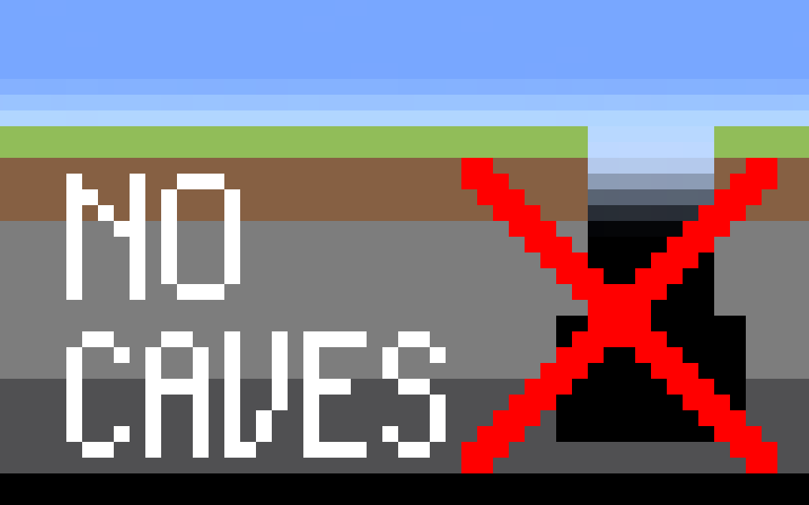

# NoCaves

Disables Noise Caves, Density Function Caves, Carver Caves, and Carver Canyons based on the configuration, and maintains compatibility with other terrain modification mods and data packs as much as possible. Affects all biomes and all world generation presets by default.

This project is in early development and is subject to change in future versions. The current target version of Minecraft is 1.20.6, which is between 1.20.x and 1.21.x versions to facilitate future migrations. Support Fabric/Forge/NeoForge mod loader.

根据配置禁用噪声洞穴、密度函数洞穴、雕刻器洞穴和雕刻器峡谷，并尽可能保持与其他地形修改模组和数据包的兼容性。默认影响所有生物群系和所有世界生成预设。

该项目处于早期开发阶段，当前目标 Minecraft 版本为 1.20.6，介于 1.20.x 和 1.21.x 版本之间，以方便将来迁移。支持 Fabric/Forge/NeoForge 模组加载器。

## Configuration 配置
The configuration file is located at `config/no_caves.json`. If the configuration file does not exist or is corrupted, a new one will be generated. If the configuration file is incomplete, a new one will be generated by merging the existing values with the default values.\
配置文件位于`config/no_caves.json`。如果配置文件不存在或损坏，会重新生成一份。如果配置文件不完整，会合并已有值和默认值并重新生成一份。

### `enableCarverFilter`
Boolean, default = `true`

Set to `true` to enable the carver filter.\
设置为`true`以启用雕刻器过滤器。

### `disabledCarverPatterns`
List of regular expressions

The specified carvers will be filtered.\
指定的雕刻器会被过滤。

### `carverFilterBiomeExclusionPatterns`
List of regular expressions

The specified biome will not be affected by carver filter.\
指定的生物群系不会受到雕刻器过滤器影响。

### `enableDensityFunctionTransformation`
Boolean, default = `true`

Set to `true` to enable the density function transformation.\
设置为`true`以启用密度函数转换。

### `densityFunctionToTransformPatterns`
List of regular expressions

The specified density function will be transformed.\
指定的密度函数会被转换。

### `enableFinalDensityTransformation`
Boolean, default = `true`

Set to `true` to enable the final density transformation.\
设置为`true`以启用最终密度转换。

### `finalDensityTransformationExclusionPatterns`
List of regular expressions

The specified noise settings' final density will not be transformed.\
指定的噪声设置的最终密度将不会被转换。

### `enableNoiseCaveFilter`
Boolean, default = `true`

Set to `true` to filter noise caves in the density function (including the final density).\
设置为`true`以在密度函数（包括最终密度）中过滤噪声洞穴。

### `noiseCavePatterns`
List of regular expressions

The names of the noise caves to filter.\
要过滤的噪声洞穴名称。

### `enableDensityFunctionCaveFilter`
Boolean, default = `true`

Set to `true` to filter references to other cave density functions in the density function (including the final density).\
设置为`true`以在密度函数（包括最终密度）中过滤对其他洞穴密度函数的引用。

### `densityFunctionCavePatterns`
List of regular expressions

The names of the cave density functions to filter.\
要过滤的洞穴密度函数名称。

## Glossary 词汇表
- [carvers](https://minecraft.wiki/w/Carver_definition): are referenced in biome definitions (`worldgen/biome`), used to add caves and canyons.
- [density functions](https://minecraft.wiki/w/Density_function): are referenced from the noise router in noise settings (`worldgen/noise_settings`), make up mathematical expressions to obtain a number from a position.
- [final density](https://minecraft.wiki/w/Noise_router#Final_density): a part of a dimension's noise settings (`worldgen/noise_settings`), is the main density function that determines whether a block position should be solid or air.

- [雕刻器](https://zh.minecraft.wiki/w/%E9%9B%95%E5%88%BB%E5%99%A8%E5%AE%9A%E4%B9%89%E6%A0%BC%E5%BC%8F)：在生物群系定义（`worldgen/biome`）中引用，用于添加洞穴和峡谷。
- [密度函数](https://zh.minecraft.wiki/w/%E5%AF%86%E5%BA%A6%E5%87%BD%E6%95%B0)：主要供噪声设置（`worldgen/noise_settings`）使用，可以根据一定的运算法则将一个坐标转换为一个数。
- [最终密度](https://zh.minecraft.wiki/w/%E5%99%AA%E5%A3%B0%E8%AE%BE%E7%BD%AE#%E5%AE%9A%E4%B9%89%E6%A0%BC%E5%BC%8F)：是噪声设置（`worldgen/noise_settings`）的一部分，是决定方块位置应为固体还是空气的主要密度函数。