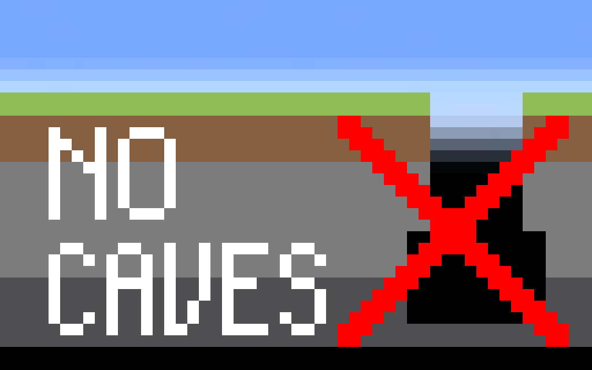

# NoCaves

\
\

Disables **Noise Caves**, **Density Function Caves**, **Generated Features**, **Carver Caves and Canyons** based on the configuration, and maintains compatibility with other terrain modification mods and data packs as much as possible. Affects all biomes and all world generation presets by default.

根据配置禁用**噪声洞穴**、**密度函数洞穴**、**地物**、**雕刻器洞穴和峡谷**，并尽可能保持与其他地形修改模组和数据包的兼容性。默认影响所有生物群系和所有世界生成预设。

## Configuration 配置

The configuration file is located at `config/no_caves.json`. If the configuration file does not exist or is corrupted, a new one will be generated. If the configuration file is incomplete, a new one will be generated by merging the existing values with the default values.\
配置文件位于`config/no_caves.json`。如果配置文件不存在或损坏，会重新生成一份。如果配置文件不完整，会合并已有值和默认值并重新生成一份。

| Key                                               | Type and default value                                       | Description                                                                                                                                                                                                                   |
|:--------------------------------------------------|:-------------------------------------------------------------|:------------------------------------------------------------------------------------------------------------------------------------------------------------------------------------------------------------------------------|
| `enableCarverFilter`                              | Boolean, default = `true`                                    | Set to `true` to enable the carver filter. 设置为`true`以启用雕刻器过滤器。                                                                                                                                                            |
| `disabledCarverPatterns`                          | List of regular expressions                                  | The specified carvers will be filtered. 指定的雕刻器会被过滤。                                                                                                                                                                       |
| `carverFilterBiomeExclusionPatterns`              | List of regular expressions                                  | The specified biome will not be affected by carver filter. 指定的生物群系不会受到雕刻器过滤器影响。                                                                                                                                           |
| `biomeSpecificOverrideForDisabledCarverPatterns`  | Mapping between biome names and lists of regular expressions | The specified biome will only filter out carvers with the corresponding value. Overrides `disabledCarverPatterns` within the current biome. 指定的生物群系只会将对应值中的雕刻器过滤掉。在当前生物群系内覆盖`disabledCarverPatterns`。                     |
| `enableFeatureFilter`                             | Boolean, default = `true`                                    | Set to `true` to enable the feature filter. 设置为`true`以启用地物过滤器。                                                                                                                                                            |
| `disabledFeaturePatterns`                         | List of regular expressions                                  | The specified features will be filtered. 指定的地物会被过滤。                                                                                                                                                                       |
| `featureFilterBiomeExclusionPatterns`             | List of regular expressions                                  | The specified biome will not be affected by feature filter. 指定的生物群系不会受到地物过滤器影响。                                                                                                                                           |
| `biomeSpecificOverrideForDisabledFeaturePatterns` | Mapping between biome names and lists of regular expressions | The specified biome will only filter out features with the corresponding value. Overrides `disabledFeaturePatterns` within the current biome. 指定的生物群系只会将对应值中的地物过滤掉。在当前生物群系内覆盖`disabledFeaturePatterns`。                   |
| `enableDensityFunctionTransformation`             | Boolean, default = `true`                                    | Set to `true` to enable the density function transformation. 设置为`true`以启用密度函数转换。                                                                                                                                          |
| `densityFunctionToTransformPatterns`              | List of regular expressions                                  | The specified density function will be transformed. 指定的密度函数会被转换。                                                                                                                                                          |
| `enableFinalDensityTransformation`                | Boolean, default = `true`                                    | Set to `true` to enable the final density transformation. 设置为`true`以启用最终密度转换。                                                                                                                                             |
| `finalDensityTransformationExclusionPatterns`     | List of regular expressions                                  | The specified noise settings' final density will not be transformed. 指定的噪声设置的最终密度将不会被转换。                                                                                                                                  |
| `enableNoiseCaveFilter`                           | Boolean, default = `true`                                    | Set to `true` to enable noise cave filter, which filters noise caves in the density function (including the final density). 设置为`true`以启用噪声洞穴过滤器，在密度函数（包括最终密度）中过滤噪声洞穴。                                                     |
| `noiseCavePatterns`                               | List of regular expressions                                  | The names of the noise caves to filter. 要过滤的噪声洞穴名称。                                                                                                                                                                       |
| `enableDensityFunctionCaveFilter`                 | Boolean, default = `true`                                    | Set to `true` to enable density function cave filter, which filters references to other cave density functions in the density function (including the final density). 设置为`true`以启用密度函数洞穴过滤器，在密度函数（包括最终密度）中过滤对其他洞穴密度函数的引用。 |
| `densityFunctionCavePatterns`                     | List of regular expressions                                  | The names of the density function caves to filter. 要过滤的密度函数洞穴名称。                                                                                                                                                          |

## Glossary 词汇表

- [carvers](https://minecraft.wiki/w/Carver_definition): are referenced in biome definitions (`worldgen/biome`), used to add caves and canyons.
- [density functions](https://minecraft.wiki/w/Density_function): are referenced from the noise router in noise settings (`worldgen/noise_settings`), make up mathematical expressions to obtain a number from a position.
- [final density](https://minecraft.wiki/w/Noise_router#Final_density): a part of a dimension's noise settings (`worldgen/noise_settings`), is the main density function that determines whether a block position should be solid or air.

- [雕刻器](https://zh.minecraft.wiki/w/%E9%9B%95%E5%88%BB%E5%99%A8%E5%AE%9A%E4%B9%89%E6%A0%BC%E5%BC%8F)：在生物群系定义（`worldgen/biome`）中引用，用于添加洞穴和峡谷。
- [密度函数](https://zh.minecraft.wiki/w/%E5%AF%86%E5%BA%A6%E5%87%BD%E6%95%B0)：主要供噪声设置（`worldgen/noise_settings`）使用，可以根据一定的运算法则将一个坐标转换为一个数。
- [最终密度](https://zh.minecraft.wiki/w/%E5%99%AA%E5%A3%B0%E8%AE%BE%E7%BD%AE#%E5%AE%9A%E4%B9%89%E6%A0%BC%E5%BC%8F)：是噪声设置（`worldgen/noise_settings`）的一部分，是决定方块位置应为固体还是空气的主要密度函数。

## Branch Information 分支信息

- **[1.20](https://github.com/Myitian/NoCaves/tree/1.20)**: supports MC 1.19.3\~1.20.4 (do not support in-game configuration on MC 1.19.3\~1.19.4)
- **[1.21](https://github.com/Myitian/NoCaves/tree/1.21)**: supports MC 1.20.5~1.21.10 (also supports MC 1.21.11 on Fabric)
- **[1.21.11](https://github.com/Myitian/NoCaves/tree/1.21.11)**: supports MC 1.21.11
- **[26](https://github.com/Myitian/NoCaves/tree/26) (current branch)**: supports MC 26.1

> [!NOTE]
>
> In the current project, the branch targeting Minecraft 26+ employs an experimental development model: since Minecraft has removed obfuscation, development for all three major loaders is now conducted entirely on Fabric Loom, with the non-Fabric loaders treated as standard dependencies. The advantages of this approach include simplified environment setup, reduced reliance on cross-platform loader frameworks, and the ability to support multiple loaders using a single JAR file. However, the drawbacks are that direct debugging on alternative loaders is not possible, and the conversion of AccessWideners to AccessTransformers must be performed manually.
>
> 当前项目中，适用于 Minecraft 26+ 的分支使用了一种实验性的开发模式——由于 Minecraft 移除了混淆，现在三个主流加载器的开发均在 Fabric Loom 上进行，其中非 Fabric 加载器作为常规依赖项使用。这种方案的优点是可以简化环境搭建和减少对跨平台加载器框架的依赖，以及实现一个 JAR 就可以适配各种加载器，缺点是无法直接在另外的加载器上调试模组，并且需要手动引入 AccessWidener 到 AccessTransformer 的转换。

## How It Works 工作原理

[简体中文](HOW_IT_WORKS.zh-Hans.md) | [English](HOW_IT_WORKS.en.md)
